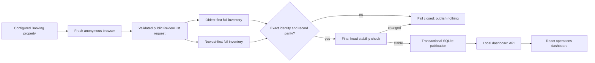

# Azzurro Review Intelligence — technical reference

This document describes the current `main` checkout at commit
`d30a9af1fc67ecd196bc805495903f17933de321`. It is based on the source code
and the existing README, run guide, dashboard guide, test report, and task
checklist.

## Purpose and architecture

The project collects public Booking.com reviews for four configured properties,
validates the result before publication, stores accepted collections in one
local SQLite file, and presents the data in an operations dashboard.

The property URLs and Booking IDs are fixed in `config/properties.json`, so a
normal run does not perform an unnecessary discovery visit. Collection and
reporting are intentionally separated: incomplete staging data can never be
shown as dashboard data.

## How the scraper approach was chosen

The initial technical question was whether Booking's visible page HTML could
provide every review, filter, category score, and pagination result accurately.
It cannot reliably do that for large properties because the complete review
feed is opened dynamically in Booking's review modal.

The approach was established by normal manual exploration of a public property
page: open the supplied Booking URL, open **Read all reviews**, change review
sorting, move through pages, and observe which network request returns the
actual review cards, totals, score buckets, filters, and category scores. That
public structured request is Booking's `ReviewList` operation.

The collector is therefore browser-assisted structured collection, rather than
a fragile DOM-clicking
scraper or a copied permanent API client. A real browser
first proves the current request contract. Direct retrieval is then used only
for that live, validated paginated request. This is faster and more reliable
than clicking or scrolling through thousands of rendered cards.

Each run uses a fresh anonymous context. This keeps the project portable and
avoids dependency on a developer's Booking account. Login does not improve the
truth of public reviews, but it would add session/cookie and privacy risk, so
the implementation deliberately does not use it.



| Area | Technology | Reason |
| --- | --- | --- |
| Runtime | Node.js 22.13+ / ES modules | One language for collector, API and tooling; includes SQLite support. |
| Browser | Playwright 1.61 | Captures the public request in a fresh real browser session. |
| Data | Node `node:sqlite` / SQLite | A portable one-file database with transactions. |
| Local API | Native Node `http` | Small loopback JSON service; no extra server framework. |
| Frontend | React 19, TypeScript, vinext/Vite | Reusable typed UI components and a simple local app. |
| Charts | Recharts | Shared rating, distribution, ranking and comparison visualisations. |
| Tests | Node test runner + rendered production checks | Separately tests contracts, storage, metrics, exports and UI rendering. |

## How collection works

Static Booking HTML is useful to establish property identity, but it is not a
reliable source for thousands of modal reviews. The page itself requests a
structured public `ReviewList` operation when the review modal opens. The
collector captures and validates that live request, then uses the proven
contract for pagination. It does not use a copied permanent API, a stored
cookie, a HAR token, a username/password, a persistent profile, or proxy
rotation.

### Full collection sequence

1. `scripts/scrape.mjs` calls `parseScrapeOptions()` and `loadProperties()`.
2. `launchScraperBrowser()` opens a fresh anonymous browser on the canonical
   public property URL.
3. Bootstrap/challenge checks confirm the expected property page.
4. A public structured `ReviewList` request is captured and converted to a
   safe live template.
5. `runPropertyCanary()` verifies both newest-first and oldest-first pages.
6. `collectInventoryPhase()` reads every page oldest-first to an explicit empty
   terminal page.
7. The same inventory is collected newest-first.
8. `assertExactInventoryParity()` requires the same unique IDs and normalised
   record hashes from both passes.
9. A final newest-first head page rejects a count, score, category, aggregate,
   or first-page record change during collection.
10. `ReviewStorage.promoteFull()` publishes the completed run atomically.

For source-card parity, equivalent Booking representations are compared
semantically: optional guest counters omitted by the source equal a normalised
`null`, and Booking CDN hostname rotation on an otherwise identical review
photo is ignored. Raw source-card JSON is still retained for audit and review
image display.

The collector supports headed `--interactive-challenge` mode. If Booking shows
an ordinary human verification screen, a person may complete it in the visible
browser. The code never solves or bypasses a challenge.

### What the collector does on Booking.com

For every configured property, the collector performs the same public actions a
guest performs while reading reviews. It visits the canonical property page,
confirms the hotel identity/score/count, opens the public review experience,
and reads all pages in oldest-first and newest-first order.

It collects public review fields that Booking returns in the response, including
score, title, review date, positive/negative comments, stay context, language,
reviewer country/type, room type, partner response, helpfulness data, and
property category-score evidence where present. It then compares both complete
inventories and rechecks the current newest page before accepting anything.

It stops if Booking returns a rate limit, access denial, challenge, unexpected
HTML, invalid response, moving count, duplicate, or inconsistency. It does not
submit reviews, make bookings, alter a listing, access a partner account,
collect passwords, use a guest account, or bypass Booking controls.

## Accuracy gates

| Gate | Requirement |
| --- | --- |
| Property identity | Captured hotel ID must equal the configured Booking hotel ID. |
| Displayed score | Property-page score must match structured-review score. |
| Advertised count | Four independent Booking “All” counts must agree. |
| Score buckets | Five disjoint score buckets must add to the advertised count. |
| Categories | A non-empty property must expose Booking category-score evidence. The category labels and displayed values are verified across the complete newest-first inventory and final newest-page check—the same route used for the published dashboard snapshot. Ancillary benchmark metadata and an alternate oldest-first presentation profile do not block an otherwise identical review inventory. |
| Response parsing | Every page and review must satisfy the strict parser contract. |
| Duplicates | Review source IDs must be unique across an inventory. |
| Completeness | Oldest/newest inventories must have exactly equal IDs and records. |
| Stability | Final head page must still match the accepted latest first page. |
| Publication | Failed or partial staging can never replace accepted data. |

`src/source-discrepancy.mjs` handles the exceptional case where Booking’s
aggregate filters advertise slightly more reviews than its own paginated list
returns. It permits only an evidenced gap up to
`min(5, floor(advertisedTotal × 1%))`; bucket shortfalls must equal the same
gap exactly. Wider, negative, or inconsistent gaps fail closed. A permitted
gap is disclosed in the dashboard and is never filled with invented reviews.

`src/visible-count-discrepancy.mjs` covers a separate Central Sydney-only case:
Booking's visible modal may be one to five above the internally consistent
structured list. The rule is pinned to both `central_sydney` and Booking hotel
ID `9888182`. The exact counts and contract are persisted in
`visible_count_discrepancy_attestations`; all other properties require equality.
The collector still paginates and publishes only the real structured rows.

## Module and function map

### Collector, browser and request contract

| File | Main functions/classes and responsibility |
| --- | --- |
| `src/cli-options.mjs` | `parseScrapeOptions()` validates mode, properties, pacing, retry limits, paths and browser options. |
| `src/property-config.mjs` | `canonicalBookingPropertyUrl()`, `derivePropertyKey()`, `loadProperties()` validate fixed property identity. |
| `src/playwright-capture.mjs` | `launchScraperBrowser()` opens anonymous property sessions; `sanitizeCaptureDiagnostics()` removes unsafe detail. |
| `src/anonymous-bootstrap.mjs` | `bootstrapAnonymousProperty()` validates public bootstrap; `contextHeaders()` returns safe request headers. |
| `src/challenge-detector.mjs` | `BrowserBootstrapError`, `isChallengeDocument()`, `isCanonicalPropertyDocument()`, `inspectBootstrapDocument()`. |
| `src/live-template.mjs` | Parses captured post data, proves operation facts, creates a template and builds safe paginated request payloads. |
| `src/http-transport.mjs` | `fetchReviewPage()` performs bounded page retrieval. |
| `src/page-fetch-transport.mjs` | `createPageFetchTransport()` adapts the validated template into a page fetcher. |
| `src/retry.mjs` | `parseRetryAfter()`, `computeBackoffDelay()`, `retryDecision()` apply bounded retry only to temporary failures. |
| `src/circuit-policy.mjs` | `nextCircuitDecision()` prevents further requests after repeated timeouts/hard stops. |

### Parsing, inventories, orchestration and storage

| File | Main functions/classes and responsibility |
| --- | --- |
| `src/review-contract.mjs` | `validateReviewListResponse()`, `normalizeReview()`, `stableStringify()`, `contentHash()`, `recordHash()`, `classifyHttpBody()`. |
| `src/collector.mjs` | `CollectionError`, `fetchValidatedPage()`, `runPropertyCanary()`, `collectInventoryPhase()`, `assertExactInventoryParity()`. |
| `src/orchestrator.mjs` | `executeCanary()` and `executeFullProperty()` run the complete lifecycle; incremental publication is deliberately refused. |
| `src/reconcile.mjs` | `reconcileCompleteRun()` and `compareSnapshots()` detect additions, edits, removals and unchanged reviews. |
| `src/photo-url-parity.mjs` | Canonicalises harmless source-photo host rotations but preserves meaningful differences. |
| `src/source-discrepancy.mjs` | `maxAllowedSourceGap()`, `identifySourceGap()`, `assertSourceGap()`, `safeSourceDiscrepancyEvidence()`. |
| `src/metrics.mjs` | `RunMetrics` stores safe timing, byte, retry and page metrics. |
| `src/redact.mjs` | `redactUrl()`, `redactSensitive()`, `redactHeaders()`, `redactForLog()` sanitise errors and logs. |
| `src/storage.mjs` | `ReviewStorage`, `canonicalJson()`, `sha256Hex()` manage schema, staging, evidence, promotion, versions and integrity. |

`ReviewStorage` uses `registerProperty()`, `beginRun()`, `beginPhase()`,
`stagePage()`, `finishPhase()`, `attestFullInventoryParity()`, `finalizeRun()`,
`promoteFull()`, `failRun()`, `getPublishedStats()`, and `integrityCheck()`.
Unchanged reviews are reused; changed reviews create immutable versions; new
reviews are inserted; missing IDs are detected. This prevents duplicate appends
on future full refreshes.

### Dashboard, insights, exports and diagnostics

| File | Main functions/classes and responsibility |
| --- | --- |
| `src/dashboard-data.mjs` | `parseDashboardQuery()` validates filters; `createDashboardDataService()` builds accepted-publication dashboard payloads. |
| `src/date-utils.mjs` | `sydneyDateFromEpoch()`, `mondayWeekStart()`, `sydneyWeekStartFromEpoch()` keep periods in `Australia/Sydney`. |
| `src/review-insights.mjs` | `classifyReviewInsights()` and `classifyReviewInsightBatch()` create evidence-backed sentiment/topic labels. |
| `src/exporter.mjs` | `exportReviewRecord()`, `recordsToCsv()`, `collectExportRecords()` create safe accepted-data exports. |
| `src/export-audit.mjs` | `auditExportData()` and `auditExportFiles()` validate privacy, identity, dates, scores and duplicates. |
| `src/score-range-diagnostic.mjs` | Two-sorter and score-bucket diagnostics without exposing review text. |
| `scripts/add-property.mjs` | Adds a validated configured property. |
| `scripts/diagnose-live-count.mjs` | Runs live score/count diagnostics. |
| `scripts/package-release.ps1` | Makes a deterministic release package while excluding credentials, profiles, logs, HARs, builds and dependencies. |

## SQLite model

`data/azzurro-reviews.sqlite` is the single local source of truth.

| Table | Role |
| --- | --- |
| `properties` | Property identity and Booking hotel ID. |
| `scrape_runs` | Audit record for every collection attempt. |
| `scrape_phases` | Oldest/newest/final-head phase lifecycle. |
| `scrape_pages` | Captured page and request metadata. |
| `scrape_page_count_evidence` | Four totals and score-bucket evidence. |
| `review_stage` | Unpublished review staging. |
| `scrape_page_reviews` | Staged page/review relationship. |
| `reviews` | Current accepted review facts. |
| `review_versions` | Immutable historical versions of changed reviews. |
| `property_publications` | Latest accepted generation for each property. |
| `property_snapshots` | Source score/count/category snapshot. |
| `full_inventory_attestations` | Two-pass identity and semantic parity proof. |
| `full_count_attestations` | Persisted total/bucket proof. |
| `source_discrepancy_attestations` | Evidence for an accepted Booking source gap. |

### Current database snapshot

The database in this checkout is populated. When checked for this document it
contained 4 registered properties, 3 accepted publications, 5,065 current
reviews, 5,065 review versions, and no source-gap attestations. This factual
state differs from some existing README claims that the committed file is empty
and all four properties are published; reconcile those claims before a final
submission.

## Review insights and reporting rules

Insight classifier version `1.0.1` is deterministic and explainable. It reads
positive and negative text separately, applies phrase variants, local negation
and contrast rules, and retains evidence for the matched phrase.

Supported operational topics are Cleanliness, Check-in experience,
Staff/reception, Noise, Facilities, Location, Room condition, and Value for
money. A review may carry more than one topic; no topic is forced when its text
does not prove one. Sentiment uses score plus text and can remain unclassified.

Reporting timezone is `Australia/Sydney`; weeks start Monday. The current week
is compared with the same elapsed days of the preceding week. A custom range is
compared with the immediately preceding equal-length range. The denominator for
negative topic share is all reviews containing negative feedback in the active
period, so multi-label topic percentages do not have to total 100%.

## Local API and dashboard collection button

`scripts/dashboard-server.mjs` runs on loopback (`127.0.0.1:4318`) and offers:

| Endpoint | Method | Function |
| --- | --- | --- |
| `/api/health` | `GET` | Local data service health. |
| `/api/dashboard` | `GET` | Filtered dashboard data from accepted publications. |
| `/api/collect` | `GET` | Collection job state and safe progress. |
| `/api/collect` | `POST` | Starts the full headed interactive collection. |
| `/api/collect` | `DELETE` | Cancels an active collection. |

Collection requests must use a loopback host plus `x-azzurro-collect: 1`; this
prevents a cross-site page from starting a real browser process. The local API
uses `createCollectJobRunner()` from `src/collect-job.mjs`, which supervises the
existing `scripts/scrape.mjs` child process and parses its progress lines. It
does not write to SQLite itself, so it cannot publish unverified data.

`dashboard/lib/collect-client.ts` exposes `fetchCollectStatus()`,
`startCollection()`, and `cancelCollection()`. `CollectControl.tsx` supplies
`useCollectJob()`, `CollectButton`, and `CollectProgress`: it polls while a job
runs, shows per-property progress, supports Stop, and reloads the dashboard
after a completed job. `AppHeader.tsx` shows **Collect reviews** and the empty
state shows **Collect reviews now**. The button requests all configured
properties; terminal commands remain suitable for a single-property run.

## Dashboard design and reusable components

`DashboardApp.tsx` owns URL state, dashboard fetches, navigation and collector
integration. Filters persist in the URL so selected property/date/review state
survives refresh.

| Component | Responsibility |
| --- | --- |
| `OverviewView.tsx` | Weekly KPIs, comparisons, rating movement, action focus. |
| `TrendsView.tsx` | Rating, sentiment, distribution and volume charts. |
| `PropertiesView.tsx` | Property cards, comparisons and Booking category-score panels. |
| `InsightsView.tsx` | Topic concentration, movement, definition and drill-down. |
| `ReviewsView.tsx` | Search, filtering, sort, pagination, review drawer and evidence. |
| `QualityView.tsx` | Collection evidence, source discrepancy, parity and publication status. |
| `GlobalFilters.tsx` | Shared property/date scope. |
| `Sidebar.tsx` | Collapsible accessible workspace navigation. |
| `components/charts/*` | Reusable Recharts visualisations. |
| `components/ui/*` | Reusable KPI cards, section cards, badges and consistent states. |
| `lib/format.ts` | Shared score/count/percentage/date/delta formatting. |
| `lib/publication-status.ts` | Single accepted/pending/source-gap label policy. |
| `lib/use-reduced-motion.ts` | Disables nonessential motion when the OS requests it. |

The CSS design system uses Azzurro-inspired navy, warm neutral and pink accents.
Charts/cards use restrained motion and `prefers-reduced-motion: reduce` turns
that motion off. The review drawer supports keyboard close and focus recovery.

## Failure handling and recovery

| Situation | Behaviour |
| --- | --- |
| Temporary transport/5xx error | Bounded retry and backoff. |
| Rate limit, access denial or challenge | Stop; do not bypass. When the local interactive collector displays a normal Booking verification page, it keeps the browser open for the configured human-verification window before treating capture as unavailable. |
| Repeated capture timeout | Circuit policy stops further requests. |
| ID/count/category/parser contract drift | Typed collection failure; publish nothing. |
| Two inventories differ | Exact parity failure; publish nothing. |
| Source changes during run | Final head mismatch; publish nothing. |
| Forced process stop | Staging stays unaccepted; rerun starts a fresh proof. |

An ordinary validation failure is isolated to that property, and collection
continues with the remaining configured properties. A hard circuit condition
such as access denial, rate limiting, or a repeated capture timeout still stops
the sequence to avoid compounding a source-access problem.
| Dashboard Stop action | Child process is cancelled; pending properties are not published. |
| Dashboard/API problem | Last loaded data is retained with a stale/error state. |

There is deliberately no autonomous scheduler, background watchdog, automatic
restart, or partial checkpoint resume. The project favours proof of a stable
complete source over the extra complexity and risk of those mechanisms.

## Commands and test coverage

```bash
# Install
npm ci
npm ci --prefix dashboard
npx playwright install chromium

# Start app and local API
npm run app
# http://127.0.0.1:3000

# Single-property terminal collection
npm run refresh:reviews -- --property olympic_paddington --headed --interactive-challenge

# Checks
npm test
npm test --prefix dashboard
npm run lint --prefix dashboard
npm run typecheck --prefix dashboard

# Accepted-data export and audit
npm run export:sample -- --out sample-data
npm run audit:export
```

The current suite contains 238 backend tests: 232 pass and six optional
HAR-dependent tests are skipped in a clean environment. Dashboard lint,
TypeScript, the production build, and two rendered-page tests also pass. Test
coverage is grouped in `test/` by CLI options, collector, parser, browser
capture, storage, reconciliation, retries/redaction, both count-discrepancy
contracts, dashboard data, exports and review insights.

## Limitations

- Booking can change the public response, rate-limit requests, or show a human
  verification screen. The collector fails closed rather than saving partial
  data.
- Reviews advertised by Booking but not returned by its own review list cannot
  be collected; the bounded discrepancy policy documents that source fact.
- Two full inventory passes take time for properties with thousands of reviews.
- Explainable rules do not claim to understand sarcasm, uncommon wording or all
  languages.
- Collection remains manually initiated; there is no schedule/restart service.

## Related documentation

- `README.md` — overview, requirements, run instructions and limitations.
- `HOW-TO-RUN.md` — operator-focused launch and collection guide.
- `dashboard/README.md` — dashboard UI, filters, accessibility and design.
- `IMPLEMENTATION-AND-TEST-REPORT.md` — earlier implementation/test report.
- `TASK-SCOPE-COVERAGE.md` and `PROJECT-TODO.md` — scope and checklist records.
